# CGRA 2020/2021 - Group T02G08

## Project Notes

## Screenshots

### 4 - MyFish

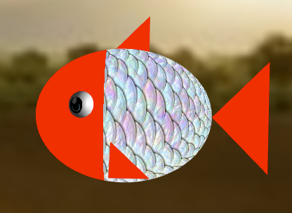
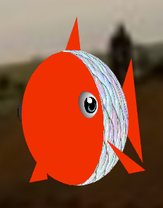
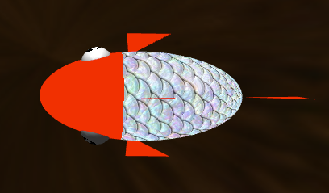

   

### 5 - Modelação de elementos da cena

  

#### 5.1  Ninho

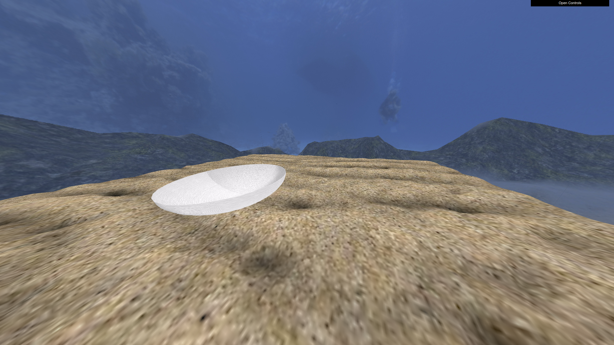
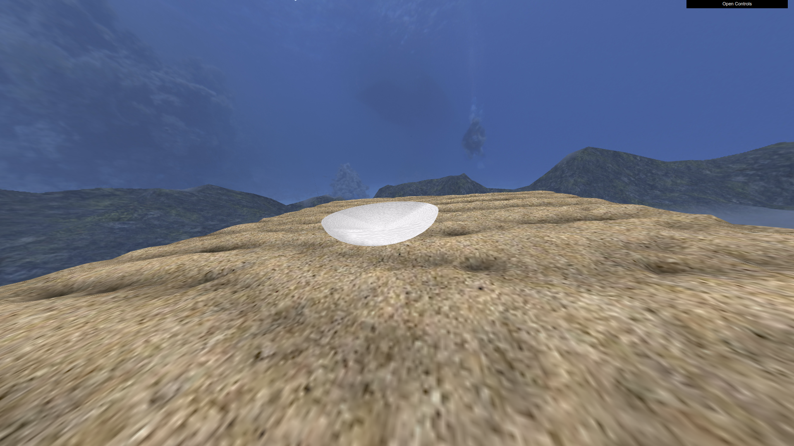

  

#### 5.2  Superfície da água

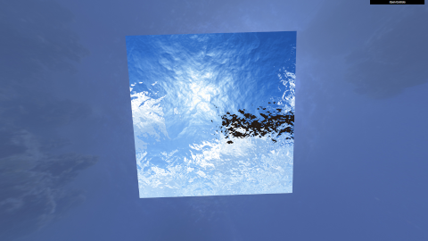

  

#### 5.3  Pedras

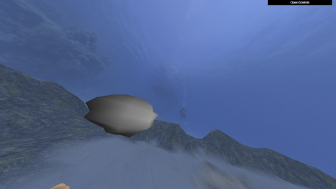
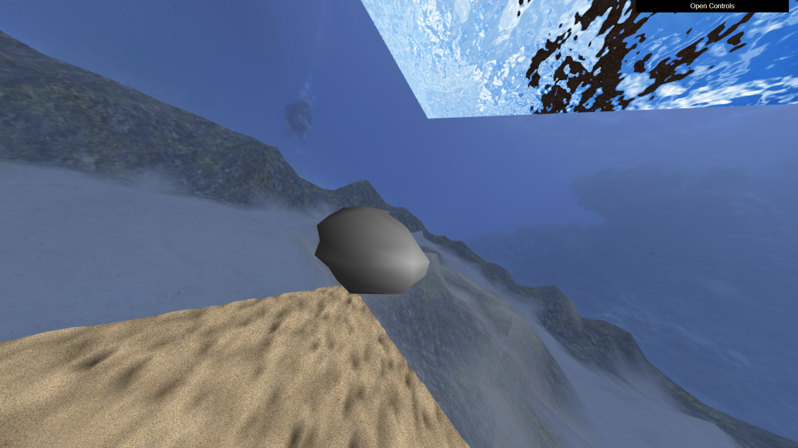

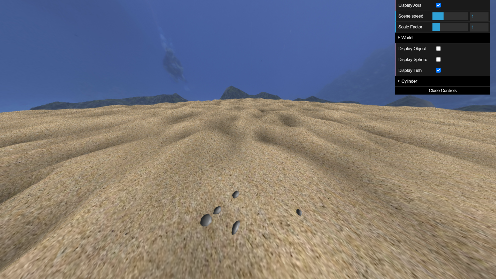
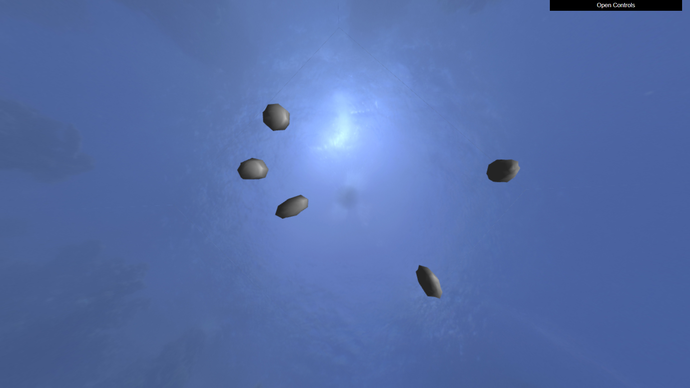

  

##### 5.4  Pilares

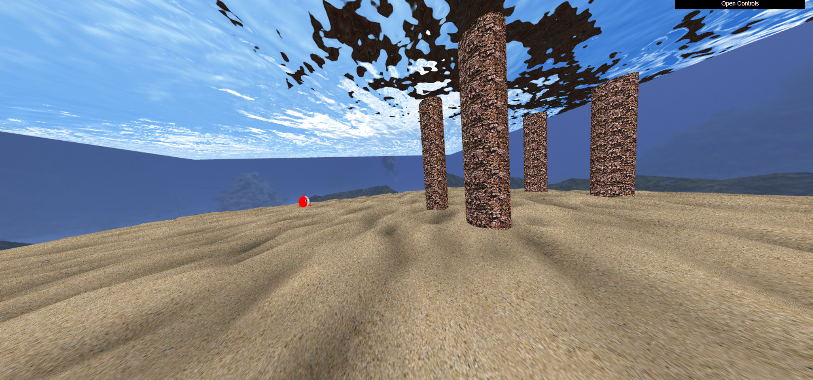

  

#### 5.5  Outros elementos(Algas)

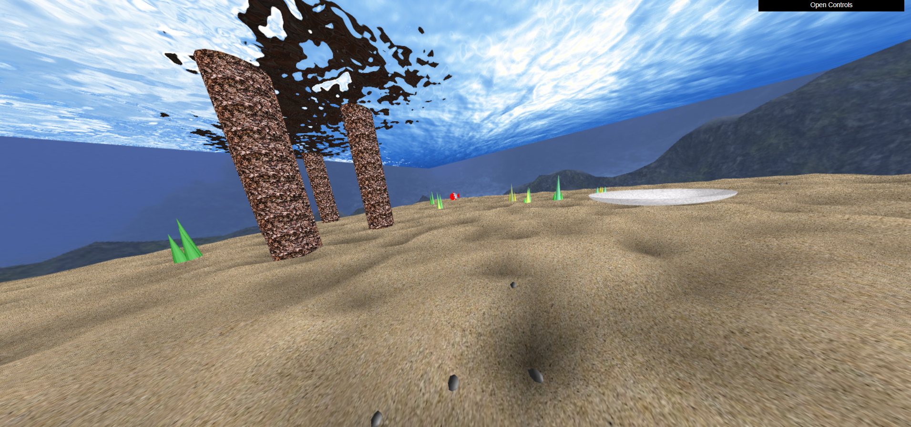
