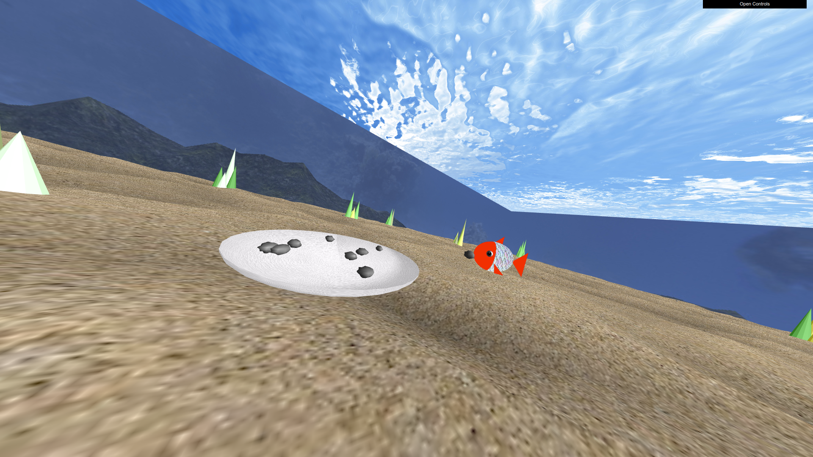

# CGRA 2020/2021 - Group T02G08

## Project Notes

## Screenshots

### 4 - MyFish

   

### 5 - Modelação de elementos da cena

  

#### 5.1  Ninho

  

#### 5.2  Superfície da água

  

#### 5.3  Pedras

  

##### 5.4  Pilares

  

#### 5.5  Outros elementos(Algas)

### 6 - Controlos e animações adicionais

#### 6.3 Recolha de pedras

