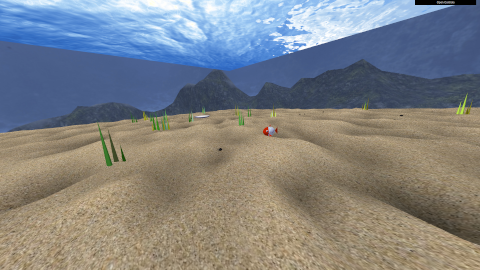

# CGRA 2020/2021 - Group T02G08

| Name             | Number    | E-Mail               |
| ---------------- | --------- | -------------------- |
| Carlos Gomes     | 201906622 | up201906622@fe.up.pt |
| Henrique Nunes   | 201906852 | up201906852@fe.up.pt |

## Project Notes

- [x] 1 - Objeto conttrolável
- [x] 2 - Criação de objetos base
- [x] 3 - Controlos adicionais na interface
- [x] 4 - MyFish - Um peixe artificial
  - [x] 4.1 - Modelação do peixe
  - [x] 4.2 - Animação do peixe
- [x] 5 - Modelação de elementos da cena
  - [x] 5.1 - Fundo de areia com "ninho"
    - O ninho foi realizado aplicando uma textura a um paraboloide achatado (superficie de semiesfera de dupla face)
  - [x] 5.2 - Superfície de água
  - [x] 5.3 - Pedras (pilares, cubemap e outros elementos)
    - Foram criados 4 pilares que são dispostos por baixo do pontão visível na superfície da água.
    - As algas dispostas em cena são agrupadas em conjuntos de 2 a 6 algas.
- [x] 6 - Controlos e animações adicionais
  - [x] 6.1 - MyMovingFish -  Peixe controlado pelo teclado
  - [x] 6.2 - Ajuste das animações ao comportamento do peixe
  - [x] 6.3 - Recolha de pedras
    - As pedras possuem formato, dimensões e posicionamento inicial variáveis e aleatórios entre si dentro de determinados limites.
- [x] 7 - Funcionalidades adicionais
  - [x] 7.1 - Algas
    - As a
  - [ ] 7.2 - Algas animadas
  - [x] 7.3 - Colocação das pedras no alvo
  - [x] 7.4 - Lançamento das pedras para o alvo
  - [ ] 7.5 - MyAnimatedFish - Animação de outros peixes
  - [x] 7.6 - Shader do peixe melhorado

## Screenshots

### 4 - MyFish

   

### 5 - Modelação de elementos da cena

 

#### 5.1  Ninho

  

#### 5.2  Superfície da água

  

#### 5.3  Pedras

  

#### 5.4  Pilares

  

#### 5.5  Outros elementos(Algas)

   

### 6 - Controlos e animações adicionais

 

#### 6.1 MyMovingFish - Peixe controlado pelo teclado
#### 6.2 Ajuste das animações ao comportamento do peixe

  

#### 6.3 Recolha de pedras

   

### 7 - Funcionalidades Adicionais

 

#### 7.1 - Algas

 

#### 7.3 - Colocação das pedras no alvo

 

#### 7.4 - Lançamento das pedras para o alvo

 

#### 7.6 - Shader do peixe melhorado

